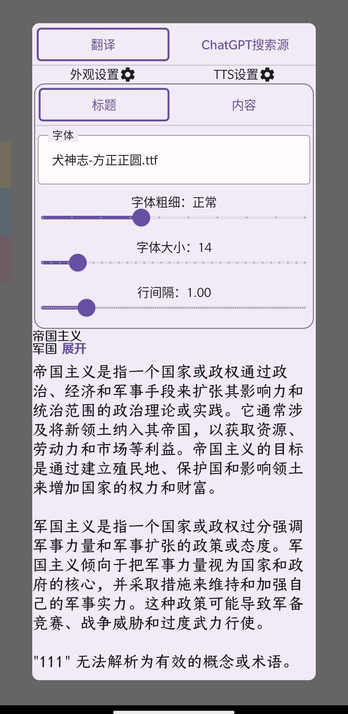
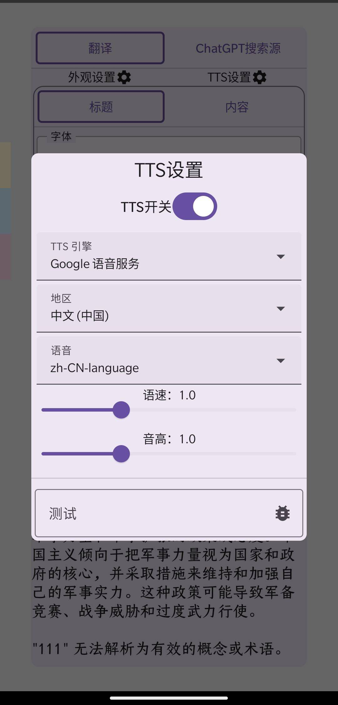
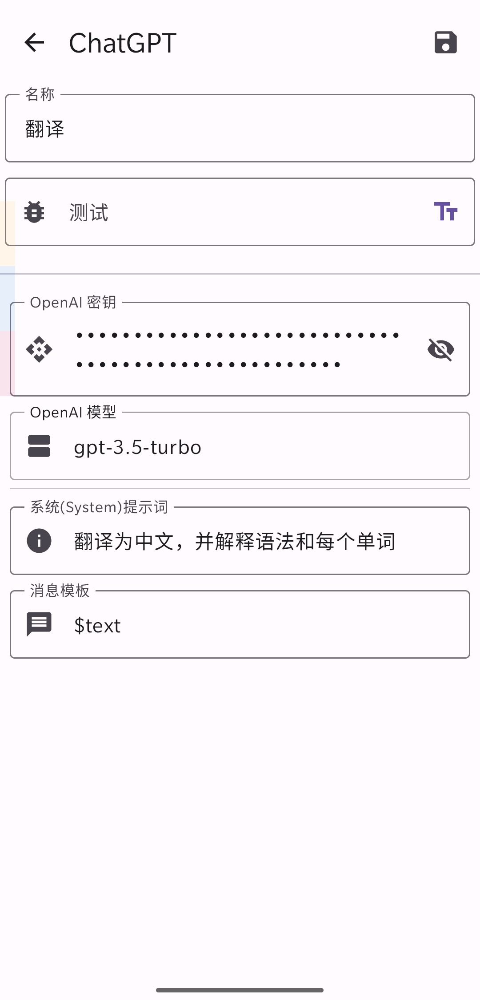

# TextSearcher
一个基于ChatGPT的划词搜索Android应用程序

# Download
- 开发版 [Github Actions](https://github.com/jing332/TextSearcher/actions) (需登录Github)
- 稳定版 [Github Releases](https://github.com/jing332/TextSearcher/releases)

# ScreenShots
 |  | 
